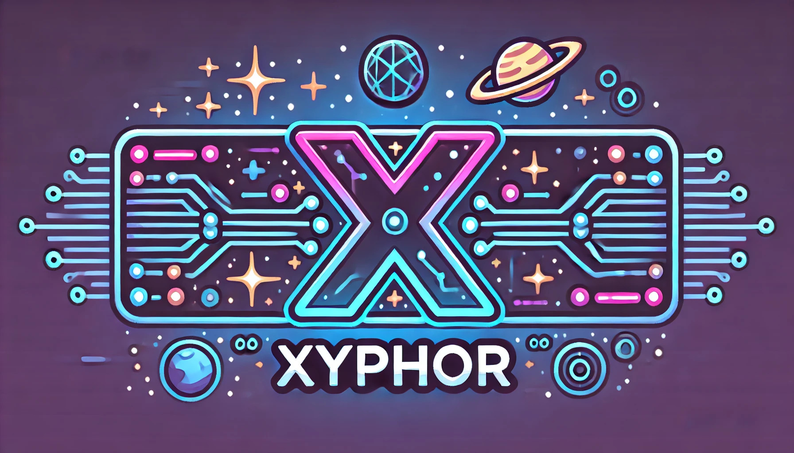

# 🚀 Xyphor - The AI-Powered, Self-Learning Programming Language  



🚀 **Xyphor is the world's first AI-powered, self-evolving programming language.**  
It **writes, optimizes, and maintains code on its own**—designed for the future of AI-driven software.  

---

## 🔥 Features  🔥
✅ **AI-Powered Compiler** – Optimizes your code in real time.  
✅ **Self-Learning Debugger** – Fixes bugs before they happen.  
✅ **GPU Acceleration** – Runs on the latest hardware.  
✅ **Write Once, Run Anywhere** – Use the Xyphor SDK to run your scripts.  

---

## 🛠 Installation  
### **1️⃣ Download the Xyphor SDK**  
**[⬇ Download Xyphor SDK](https://github.com/V1zul/Xyphor/releases)**  

### **2️⃣ Run a Xyphor Program** ###

📝 **Xyphor Syntax**
Here’s how you write a Hello World program in Xyphor:
```
task Main() -> int {
    print("Hello, Xyphor!");
    return 0;
}
```
✅ Want more? Check out the Documentation.
**(xyphor.dev)**
🔥 Download the SDK and start scripting today! 🔥
